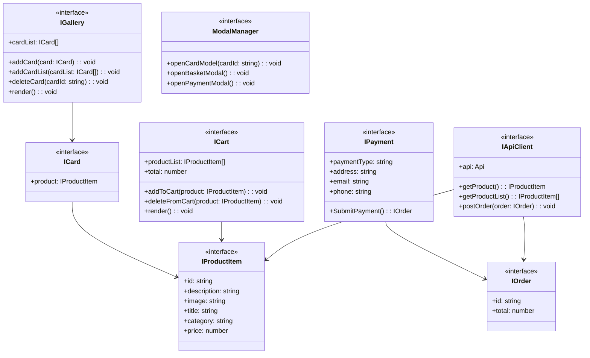

# Проектная работа "Веб-ларек"

Стек: HTML, SCSS, TS, Webpack

Структура проекта:
- src/ — исходные файлы проекта
- src/components/ — папка с JS компонентами
- src/components/base/ — папка с базовым кодом

Важные файлы:
- src/pages/index.html — HTML-файл главной страницы
- src/types/index.ts — файл с типами
- src/index.ts — точка входа приложения
- src/scss/styles.scss — корневой файл стилей
- src/utils/constants.ts — файл с константами
- src/utils/utils.ts — файл с утилитами

## Установка и запуск
Для установки и запуска проекта необходимо выполнить команды

```
npm install
npm run start
```

или

```
yarn
yarn start
```
## Сборка

```
npm run build
```

или

```
yarn build
```

## Архитектура



### Интерфейсы данных
#### IProductItem
Содержит информацию о товаре:

* id: string — уникальный идентификатор товара

* description: string — описание товара

* image: string — путь до изображения товара

* title: string — название товара

* category: string — категория товара

* price: number — цена товара

#### IOrder
Содержит информацию о заказе:

* id: string — уникальный идентификатор заказа

* total: number — общая сумма заказа

#### ICard
Содержит информацию о карточке товара:

* product: IProductItem — товар, отображаемый в карточке

### Компоненты
#### IGallery
Компонент для отображения списка товаров:

* cardList: ICard[] — список карточек товаров

* addCard(card: ICard): void — добавляет карточку в список

* addCardList(cardList: ICard[]): void — добавляет список карточек

* deleteCard(cardId: string): void — удаляет карточку по ID

* render(): void — отрисовывает компонент

#### ICart
Компонент корзины:

* productList: IProductItem[] — список товаров в корзине

* total: number — общая стоимость товаров в корзине

* addToCart(product: IProductItem): void — добавляет товар в корзину

* deleteFromCart(product: IProductItem): void — удаляет товар из корзины

* render(): void — отрисовывает компонент

#### IPayment
Компонент оплаты:

* paymentType: paymentType — тип оплаты ("онлайн" или "при получении")

* address: string — адрес доставки

* email: string — email покупателя

* phone: string — телефон покупателя

* SubmitPayment(): IOrder — отправляет данные оплаты и возвращает заказ

### Управление модальными окнами
#### ModalManager
Управляет открытием модальных окон:

* openCardModel(cardId: string): void — открывает модальное окно карточки товара

* openBasketModal(): void — открывает модальное окно корзины

* openPaymentModal(): void — открывает модальное окно оплаты

### Работа с API
#### IApiClient
Обеспечивает взаимодействие с API:

* api: Api — экземпляр API-клиента

* getProduct(): IProductItem — получает информацию о товаре

* getProductList(): IProductItem[] — получает список товаров

* postOrder(order: IOrder): void — отправляет заказ на сервер